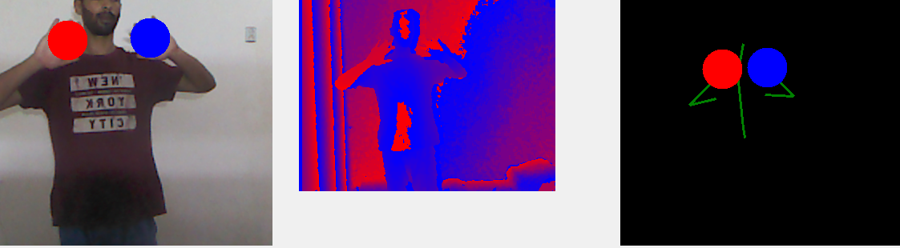
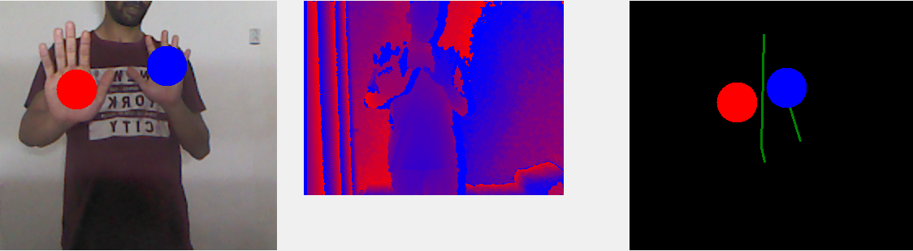
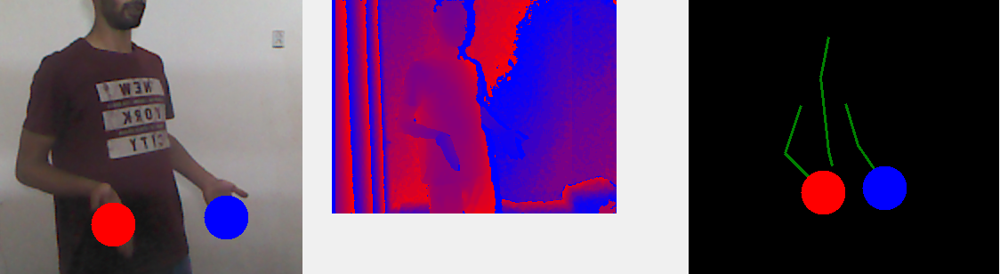

# Kinect Hand Detection

## Overview
This project presents a prototype system for hand detection using Microsoft Kinect v1.
The system identifies hands in real-time and visualizes them with colored circles:
•	Blue circle for the left hand
•	Red circle for the right hand
The goal is to provide a foundation for natural human–computer interaction and future gesture recognition.
## Screenshots

*Blue = left hand, Red = right hand*
## Technologies
- C#
- Microsoft Kinect SDK v1
- Computer Vision

## Features
•	Real-time hand detection
•	Left/right hand visualization with colored circles
•	Lightweight prototype for research and experimentation

## Research Context
This project is related to Human Activity Recognition (HAR) and natural interaction
systems for Virtual Reality and intelligent environments.

## Status
Research prototype / proof of concept.
